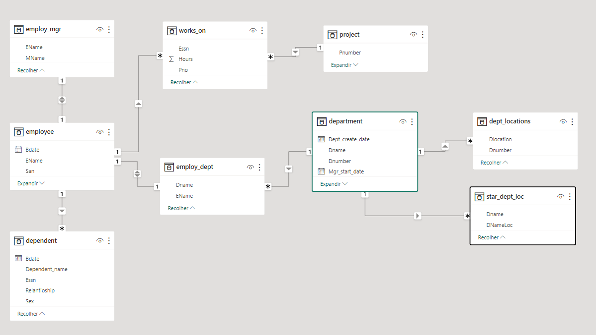

# desafio-dio-dados-powerbi
Desafio de projeto da plataforma [DIO](https://web.dio.me/) - Processando e Transformando Dados com Power BI

## Objetivo:

O objetivo deste projeto é coletar e transformar dados demonstrando a integração Azure, MySql e Power BI.

Infraestrutura:
* Criar uma instância na Azure para MySQL
* Criar o Banco de dados com base disponível no [Github](https://github.com/julianazanelatto/power_bi_analyst)
* Integração do Power BI com MySQL no Azure
* Verificar problemas na base a fim de realizar a transformação dos dados

Transformação dos dados:
* Verifique os cabeçalhos e tipos de dados
* Modifique os valores monetários para o tipo double preciso
* Verifique a existência dos nulos e analise a remoção
* Os employees com nulos em Super_ssn podem ser os gerentes. Verifique se há algum colaborador sem gerente
* Verifique se há algum departamento sem gerente
* Se houver departamento sem gerente, suponha que você possui os dados e preencha as lacunas
* Verifique o número de horas dos projetos
* Separar colunas complexas
* Mesclar consultas employee e departament para criar uma tabela employee com o nome dos departamentos associados aos colaboradores. A mescla terá como base a tabela employee. Fique atento, essa informação influencia no tipo de junção
* Neste processo elimine as colunas desnecessárias.
* Realize a junção dos colaboradores e respectivos nomes dos gerentes . Isso pode ser feito com consulta SQL ou pela mescla de tabelas com Power BI. Caso utilize SQL, especifique no README a query utilizada no processo.
* Mescle as colunas de Nome e Sobrenome para ter apenas uma coluna definindo os nomes dos colaboradores
* Mescle os nomes de departamentos e localização. Isso fará que cada combinação departamento-local seja único. Isso irá auxiliar na criação do modelo estrela em um módulo futuro.
* Explique por que, neste caso supracitado, podemos apenas utilizar o mesclar e não o atribuir.
* Agrupe os dados a fim de saber quantos colaboradores existem por gerente
* Elimine as colunas desnecessárias, que não serão usadas no relatório, de cada tabela

### Obs

Estou disponibilizando o [script](scripts.sql) para a criação da base de dados, com as correções e ajustes necessários para o MySQL.

Diagrama de relacionamento das entidades

Os arquivos de dados e as referências estão disponíveis no repo: 
[https://github.com/julianazanelatto/power_bi_analyst]

